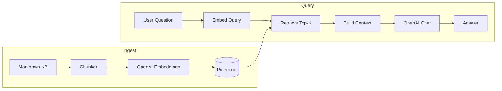

# RAG Learning Lab — 1-Hour Workshop Guide

Use this document to build slides and speaker notes. Your plan (one slide per stage + technologies + live demo) is solid. This guide adds timing, narrative flow, and what to say when.

---

## Review of your approach

**What works well**

- **Progressive story** (Basic → Chunking → Hybrid → Rerank) matches how teams actually mature RAG in production.
- **Separate slide per stage** keeps the audience oriented; pair each slide with a **live compare** or single-stage demo.
- **Technology per slide** grounds abstract ideas in your real stack (OpenAI, Pinecone, Express, React).

**Suggestions**

1. **Open with one diagram** (5 min): ingest → embed → store → retrieve → generate. Refer back to it on every stage slide.
2. **Do not claim one stage is always “best.”** Say: “Better for different query types” (semantic vs exact ID vs multi-doc).
3. **Live demo after Stage 2 and Stage 4** — not after all four at once. Short demos stick better in one hour.
4. **Keep slides thin** — bullets on slide; stories and numbers in speaker notes.
5. **End with production checklist** (chunking strategy, hybrid when?, rerank cost/latency).

---

## 60-minute agenda

| Time | Block | Format |
|------|--------|--------|
| 0:00–0:05 | Why RAG, workshop goals | Slides |
| 0:05–0:10 | Architecture & shared stack | Slide + diagram |
| 0:10–0:18 | Stage 1: Basic RAG | Slide + optional quick chat demo |
| 0:18–0:28 | Stage 2: Better chunking | Slide + **compare demo Q1** |
| 0:28–0:38 | Stage 3: Hybrid search | Slide + **compare demo Q2** |
| 0:38–0:48 | Stage 4: Reranked RAG | Slide + **compare demo Q3** |
| 0:48–0:55 | Compare-all + debug panel tour | Live app |
| 0:55–1:00 | Production takeaways & Q&A | Slides |

Adjust ±5 min based on audience size and questions.

---

## Slide 0 — Title & goals

**On slide**

- Title: *RAG Learning Lab: From Basic RAG to Production Patterns*
- Goals:
  - Understand the RAG pipeline end-to-end
  - See four retrieval strategies side-by-side
  - Know which lever to pull when answers are wrong

**Speaker notes**

- “We’re not building production scale today — we’re building **clarity**.”
- “Same documents, same LLM, same embeddings — **only retrieval changes** between stages.”
- “You’ll leave with a mental model: when answers fail, is it chunking, search, or ranking?”

---

## Slide 1 — What is RAG? (shared foundation)

**On slide**

```
User question
    → Embed query (OpenAI)
    → Retrieve chunks (Pinecone)
    → Build context
    → LLM answer (OpenAI)
```

- **Ingest (offline):** Load MD → Chunk → Embed → Upsert to Pinecone
- **Query (online):** Embed question → Search → Top-K chunks → Prompt → Answer

**Speaker notes**

- RAG = **retrieve** then **generate**. The model does not magically know your policies; it only sees what retrieval puts in the prompt.
- **Failure modes:** wrong chunks (retrieval), right chunks but model ignores them (prompt), or no chunks indexed (ingest).
- Our lab uses a fake **Acme Corp** knowledge base (5 policy markdown files).

**Technologies (shared across all stages)**

| Layer | Technology | Role |
|-------|------------|------|
| UI | React + Vite | Workshop compare UI, debug panel |
| API | Node.js + Express | Four independent `/api/chat/*` pipelines |
| Embeddings | OpenAI `text-embedding-3-small` (1536-d) | Query + document vectors |
| Vector DB | Pinecone (1 index, 4 namespaces) | Isolated indexes per stage |
| LLM | OpenAI `gpt-4o-mini` (configurable) | Final answer from context |
| Data | `/data` markdown files | Employee handbook, security, AWS, leave, engineering |

---

## Slide 2 — Stage 1: Basic RAG

**On slide**

**Stage 1 — Basic RAG**

- Fixed-size chunks (~500 chars, no overlap)
- Vector search only (cosine similarity)
- Top **5** chunks → LLM
- Pinecone namespace: `basic`

**Technologies**

- Chunking: `basicChunker()` — character windows
- Retrieval: Pinecone semantic search only
- No keyword search, no reranking

**When it’s enough**

- Simple FAQs, single-doc answers, prototyping

**Speaker notes**

- “This is what most teams ship first: split docs, embed, search, ask GPT.”
- **Weakness:** chunks can cut mid-sentence or mid-table; policy IDs like `POLICY-SEC-2025` may sit on a boundary.
- **Product impact:** fast to build, lowest engineering cost; answer quality plateaus on structured enterprise docs.
- **In our app:** `POST /api/chat/basic` — same flow as others, different namespace at ingest time.

**Optional 30-sec demo**

- Ask: *“How do I request AWS access?”* in Basic only — works, but compare later to show chunk/debug differences.

---

## Slide 3 — Stage 2: Better Chunking RAG

**On slide**

**Stage 2 — Better Chunking**

- **Same** retrieval as Basic (vector only, top 5)
- **Different** at ingest: `improvedChunker()`
  - Split on headings (`#`, `##`)
  - Paragraph-aware merges
  - ~400 chars target, **80 char overlap**
- Pinecone namespace: `chunked`

**Technologies**

- Structure-aware chunking (no extra vector DB)
- Metadata: `source`, `heading`, `chunkIndex` on each vector
- Still OpenAI embeddings + Pinecone cosine search

**What improves**

- Cleaner chunk boundaries → better semantic matches
- Section titles preserved in metadata (debug panel shows section)

**Speaker notes**

- “We did **not** change the search algorithm yet — only **how documents are sliced**.”
- If Basic and Chunked give the same answer, that’s OK — the lesson is *retrieval quality starts before the vector DB*.
- **Product impact:** cheap win; re-ingest required when chunk strategy changes.
- Overlap helps when answers span two paragraphs (e.g. leave policy + carryover rules).

**Demo (3–4 min) — Compare or single stage**

- Question: *“Which documents mention SEC-CONTROL-MFA-A17, and what does each one say about MFA?”*
- Show **debug panel**: chunks, sources, headings.
- Narrate: Chunked may list more sections; watch for duplicate sections vs Basic.

---

## Slide 4 — Stage 3: Hybrid Search RAG

**On slide**

**Stage 3 — Hybrid Search**

- Vector top **10** + keyword (BM25-style) top **10**
- **Reciprocal Rank Fusion (RRF)** → final top **5**
- Boost exact tokens: `POLICY-SEC-2025`, `SEC-CONTROL-MFA-A17`, `AWS-ACCESS-REQUEST`
- Pinecone namespace: `hybrid` + in-memory keyword index (built at ingest)

**Technologies**

- Semantic: Pinecone + OpenAI embeddings (unchanged)
- Keyword: inverted index, TF-IDF/BM25-lite scoring
- Fusion: RRF with higher weight on keyword branch
- Source diversity: cap chunks per document in merge

**What improves**

- Exact policy codes, ticket template names, acronyms
- Queries that match **words** more than **meaning**

**Speaker notes**

- “Embeddings are great for paraphrase; they can miss **exact IDs**.”
- Hybrid is common in production: Elasticsearch + vector, or Postgres full-text + pgvector.
- **Product impact:** more moving parts (second index to maintain); keyword index must be rebuilt on re-ingest.
- **Trade-off:** slightly higher latency (two retrieval paths + merge).

**Demo (3–4 min)**

- Question: *“I found POLICY-SEC-2024 in an old ticket. Is it still valid, and what control ID should we use now for AWS console MFA?”*
- Point at debug: **keyword scores** (Hybrid only), higher fusion scores on token hits.
- Say: retired policy vs active policy — keyword helps disambiguate.

---

## Slide 5 — Stage 4: Reranked RAG

**On slide**

**Stage 4 — Reranked RAG**

- Retrieve top **20** by vector similarity
- **Rerank** candidates → keep top **5**
- Default: `simpleRerank` (vector score + query term overlap)
- Optional: Cohere Rerank API if `COHERE_API_KEY` set
- Dedupe by `source + heading` before LLM
- Pinecone namespace: `rerank`

**Technologies**

- Broad recall (K=20) then precision (rerank to 5)
- Reranker: local scoring or Cohere `rerank-english-v3.0`
- Same LLM + context builder as other stages

**What improves**

- Less noise in the prompt → fewer hallucinations
- Better multi-constraint questions (lockout rules **and** AWS MFA)

**Speaker notes**

- “Vector search optimizes **similarity**, not **usefulness for this exact question**.”
- Reranking is a standard production step (Cohere, Voyage, cross-encoders, or LLM-as-judge).
- **Product impact:** extra latency + optional API cost; biggest gain on noisy corpora or long policies.
- **Trade-off:** if initial top-20 misses the right doc, rerank cannot fix it — still need good chunking + hybrid.

**Demo (3–4 min)**

- Question: *“In POLICY-SEC-2025, what are the password lockout rules after failed attempts, and how does that relate to AWS initial console login requirements?”*
- Toggle **Developer mode**: show final context size vs Basic.
- Compare-all: four columns — narrate structure and grounding, not “winner.”

---

## Slide 6 — Side-by-side summary

**On slide**

| Stage | Main lever | Retrieval | Typical win |
|-------|------------|-----------|-------------|
| 1 Basic | None | Vector top-5 | Baseline |
| 2 Chunked | Ingest / chunks | Vector top-5 | Structure, tables, sections |
| 3 Hybrid | + Keyword + RRF | Vector + BM25 → 5 | IDs, codes, exact phrases |
| 4 Rerank | + Reranker | Top-20 → rerank → 5 | Prompt quality, multi-part Q |

**Same everywhere:** OpenAI embed, Pinecone, Express API, React UI, grounded system prompt.

**Speaker notes**

- “Production systems often combine **2 + 3 + 4** — not pick one forever.”
- Debugging order: (1) right chunks in top-K? (2) right chunk in prompt? (3) model followed context?

---

## Slide 7 — Live app tour (debug & compare)

**On slide**

- **Compare All** — one question, four pipelines
- **Debug panel** — chunks, scores, sources
- **Developer mode** — full prompt + token usage
- Sample questions baked into UI (3 demo queries)

**Speaker notes**

- Walk through status bar: backend connected, namespace vector counts.
- “This is how you **teach** RAG to PMs and engineers — make retrieval visible.”
- Do **not** over-index similarity scores across stages (Hybrid keyword scores are on a different scale).

---

## Slide 8 — Production takeaways

**On slide**

1. **Start with Basic** — validate use case and data
2. **Fix chunking early** — biggest ROI per engineering hour
3. **Add hybrid** when users search IDs, SKUs, error codes, policy numbers
4. **Add rerank** when answers are “almost right” but context is noisy
5. **Observe:** latency, cost per query, re-ingest on doc updates
6. **Not in this lab:** auth, evals, caching, multi-tenant — but same pipeline shape

**Speaker notes**

- Mention Pinecone namespaces vs separate indexes — we used namespaces for teaching clarity.
- Open floor: “Where would you add hybrid first in your product?”

---

## Recommended demo script (copy-paste questions)

Use **Compare All** for each. Pause 10 seconds after results load.

1. **SEC-CONTROL-MFA-A17 (cross-doc)**  
   *Which documents mention SEC-CONTROL-MFA-A17, and what does each one say about MFA?*

2. **POLICY-SEC-2024 (disambiguation)**  
   *I found POLICY-SEC-2024 in an old ticket. Is it still valid, and what control ID should we use now for AWS console MFA?*

3. **Multi-part policy (rerank story)**  
   *In POLICY-SEC-2025, what are the password lockout rules after failed attempts, and how does that relate to AWS initial console login requirements?*

**What to say between demos**

- “Same question, same model — watch **chunks** and **answer structure** change.”
- “If all four look similar, the question may be too easy — try question 2 or 3.”

---

## Pre-workshop checklist

- [ ] `npm run ingest` completed after latest `data/` changes
- [ ] Backend + frontend running (`npm run dev`)
- [ ] Status bar shows vectors in all 4 namespaces
- [ ] OpenAI + Pinecone keys valid (billing OK)
- [ ] Browser zoom 100%, dark UI readable on projector
- [ ] Slides PDF + this doc on second screen
- [ ] Backup: screenshots of compare-all for 3 questions if Wi‑Fi fails

---

## Likely audience questions (short answers)

**Why four namespaces instead of one index with metadata?**  
So each stage is isolated for teaching; production might use one index with `stage` metadata filter.

**Why Pinecone not pgvector?**  
Managed ops, fast workshop setup; concepts transfer.

**Is hybrid always better than chunked?**  
No — extra complexity; use when exact-token queries matter.

**Does rerank fix bad chunking?**  
No — garbage in, garbage out. Chunking + retrieval breadth first.

**Cost?**  
Ingest: embed all chunks × 4 namespaces. Query: 1 embed + 1 LLM call per stage; compare-all = 4× per click.

---

## One-line narrative (memorize)

> “We keep the brain the same and improve what we feed it — first **how we cut** documents, then **how we find** them, then **which pieces we trust** before the LLM speaks.”

---

## Optional appendix — Mermaid for Slide 1



Copy into slides or draw on whiteboard.
